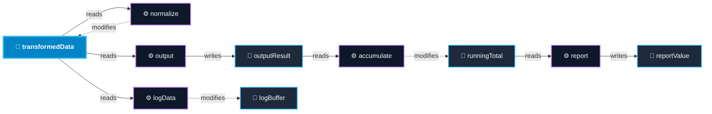

# ⚡ DPX-Cpp: Pattern Scanner, Software Architecture Analyzer & Data Flow Engine for C++

> **Hexagonal Architecture (Ports & Adapters) + Domain-Driven Design (DDD)** static analysis and software design pattern detection engine for **C++ (C++14 / 17 / 20 / 23)** powered by **ANTLR4** grammar parsing and **SciTools Understand-parity Data Flow Out / In Analysis**.

[](https://www.python.org/)
[](https://en.cppreference.com/)
[]()
[](https://www.antlr.org/)
[-success.svg?style=flat)]()
[]()
[-orange.svg?style=flat)]()
[-purple.svg?style=flat)]()

---

## 🏛 Architecture Overview

The system strictly follows **Domain-Driven Design (DDD)** and **Hexagonal Architecture (Ports & Adapters)**. The domain layer has **zero knowledge** of ANTLR, grammar tokens, AST implementation details, filesystem, or CLI frameworks.

```text
                    ┌────────────────────────────────────────────────────────┐
                    │                    Driving Adapters                    │
                    │                                                        │
                    │   Typer + Rich CLI         /       Python SDK API      │
                    └───────────────────────────┬────────────────────────────┘
                                                │
                                                ▼
                    ┌────────────────────────────────────────────────────────┐
                    │                   Application Layer                    │
                    │                                                        │
                    │     ScanningService (Pipeline Coordinator & Use Cases) │
                    └───────────────────────────┬────────────────────────────┘
                                                │
                                      ┌─────────▼─────────┐
                                      │    DOMAIN CORE    │
                                      │                   │
                                      │  CodeModel        │
                                      │  35 AnalysisRules │
                                      │  DataFlowService  │
                                      │  Confidence Model │
                                      │  Evidence Trail   │
                                      │  Dependency Graph │
                                      └─────────┬─────────┘
                                                │
                    ┌───────────────────────────▼────────────────────────────┐
                    │                      Ports / SPI                       │
                    │                                                        │
                    │   Inbound:  ScannerPort, DetectorPort, DataFlowPort    │
                    │   Outbound: ParserPort, SourceProviderPort,            │
                    │             ResultRepositoryPort, ReportFormatterPort  │
                    └───────────────────────────┬────────────────────────────┘
                                                │
                    ┌───────────────────────────▼────────────────────────────┐
                    │                    Driven Adapters                     │
                    │                                                        │
                    │   • ANTLR4 C++ Parser (CPP14Lexer.g4 / CPP14Parser.g4) │
                    │   • Fast Brace-Balanced Macro-Tolerant Def-Use Parser  │
                    │   • FileSystem Source Provider (.cpp, .hpp recursive)  │
                    │   • Interactive HTML Dashboard Formatter & Repository  │
                    │   • GitHub-Flavored Markdown Formatter & Repository    │
                    │   • JSON Result Repository                             │
                    │   • Rich Console Terminal Tree Formatter               │
                    └────────────────────────────────────────────────────────┘
```

---

## 🌲 Data Flow Analysis (SciTools Understand Parity)

DPX-Cpp includes a full **Def-Use Data Flow Graph Engine** parity with **SciTools Understand**:

* **Data Flow Out (Forward Graph):** Rooted at a selected variable or object, shows every function that reads/uses its value, then recurses into whatever objects that function writes or modifies, continuing through the entire computation forward.
* **Data Flow In (Backward Graph / Slicing):** The inverse relationship — traces backward from a target variable to everything that sets or modifies it, and all input sources contributing to its value.
* **Relationship Path:** Filters the graph to only paths connecting two specific entities (e.g., `transformedData` $\to$ `reportValue`).
* **Cluster Variant:** Automatically groups entities and functions by their containing class, namespace, or file.
* **Multi-Format Visualizers:** Interactive **Rich Terminal Trees**, **Mermaid.js** diagrams, and **JSON** export.

### Example C++ Code:
```cpp
extern int auxData;
extern int transformedData;
extern int outputResult;
extern int logBuffer;
extern int runningTotal;
extern int reportValue;

void normalize() {
    if (transformedData > 100) transformedData = 100;
    else transformedData = transformedData + auxData;
}
void output()     { outputResult = transformedData; }
void logData()    { logBuffer += transformedData; }
void accumulate() { runningTotal += outputResult; }
void report()     { reportValue = runningTotal; }
```

### Data Flow Out (Mermaid.js Diagram):


---

## 📐 Catalog of 35 Supported Rules & Principles (100% GoF Coverage)

DPX-Cpp analyzes C++ codebases across **5 major categories**:

### 1. 🏗 Creational Patterns (GoF 5/5)
1. **Abstract Factory**: Factory interfaces declaring multiple product creation families.
2. **Builder**: Method chaining / fluent builders returning references (`Builder&`).
3. **Factory Method**: Virtual factory methods producing concrete product variants.
4. **Prototype**: Classes declaring `clone()` / copy-creation returning polymorphic pointers.
5. **Singleton**: Meyers' Singleton, deleted copy/move constructors, private constructors, static instance fields.

### 2. 🏛 Structural Patterns (GoF 7/7)
6. **Adapter**: Object & Class adapters adapting legacy/incompatible interfaces.
7. **Bridge / PIMPL Idiom**: Decoupled abstraction & implementation driver (`std::unique_ptr<Impl> pImpl`).
8. **Composite**: Part-whole hierarchies unifying leaf elements and container records.
9. **Decorator**: Wrapping same abstract component interface to dynamically augment behavior.
10. **Facade**: High-level unified interfaces coordinating multiple sub-systems.
11. **Flyweight**: Factories managing shared intrinsic object pools and flyweight instances.
12. **Proxy**: Surrogates controlling access / lazy-initialization to real subjects.

### 3. 🎯 Behavioral Patterns (GoF 11/11)
13. **Chain of Responsibility**: Handler chains passing requests along dynamic successor links.
14. **Command**: Command objects encapsulating actions and parameters (`execute()`).
15. **Interpreter**: Domain grammar expression hierarchies (`AbstractExpression` with `interpret()`).
16. **Iterator**: Sequential traversal contracts (`first()`, `next()`, `isDone()`, `currentItem()`).
17. **Mediator**: Central event brokers / dispatchers decoupling colleague components.
18. **Memento**: State snapshot & history rollback managers (`setState()`, `getState()`).
19. **Observer**: Observable subject managing event subscriber lists (`Observer` & `Subject`).
20. **State**: Polymorphic state machines delegating behavior to interchangeable state objects.
21. **Strategy**: Interchangeable algorithmic strategies with clean interface encapsulation.
22. **Template Method**: Base class skeleton algorithm calling primitive step operations.
23. **Visitor**: Double-dispatch visitor (`Visitor` interface with overloaded `visit()` + `accept()`).

### 4. 💎 SOLID & Clean Code Principles
24. **Single Responsibility (SRP)**: God Object detector filtering out standard DTO getters/setters.
25. **Open/Closed (OCP)**: Detects fragile `dynamic_cast<T*>` and `typeid` cascades vs extensible polymorphic hierarchies.
26. **Liskov Substitution (LSP)**: Detects overridden methods throwing `std::runtime_error("unsupported")` or breaking parent contracts.
27. **Interface Segregation (ISP)**: Fat Abstract Classes (>8 pure virtual methods) vs Focused Role Interfaces (1-3 pure virtual methods).
28. **Dependency Inversion (DIP)**: Flags hardcoded concrete instantiations in business services vs injected interface abstractions.
29. **Composition over Inheritance**: Deep inheritance tree analyzer (flags hierarchies with depth $\ge 3$).
30. **Law of Demeter (LoD)**: Train-wreck call detector (`a->getB()->getC()->doSomething()`) with built-in exclusions for STL and fluent APIs.
31. **High Cohesion & Low Coupling**: Efferent coupling (Fan-Out) metric analyzing cross-namespace dependencies.
32. **Keep It Simple, Stupid (KISS)**: Long parameter lists ($\ge 6$) and high cyclomatic branching complexity.
33. **Don't Repeat Yourself (DRY)**: Structural cross-method duplicate code logic detector.

### 5. 🔄 Architectural & System Patterns
34. **Lifecycle Component**: RAII lifecycle management (`~Destructor()`, `start()`, `stop()`, `init()`, `shutdown()`).
35. **Circular Dependency**: Tarjan/DFS topological cycle detector identifying circular `#include` / namespace dependencies.

---

## 🛡️ False-Positive Prevention & Precision

DPX-Cpp implements specialized heuristic filters for modern idiomatic C++:

* **DTO / POD Struct Whitelist:** Classes with getters/setters (`get*`, `set*`, `is*`, `has*`) are never misidentified as SRP God Objects.
* **Standard Operators Excluded:** `operator==`, `operator!=`, `operator<` comparing members are ignored by OCP cascades.
* **STL & Fluent API Excluded from LoD:** `std::string`, `std::optional`, `std::ranges`, `std::vector`, and fluent builders do not trigger Law of Demeter violations.
* **Container Exemption in DIP:** Instantiations of STL containers (`std::vector`, `std::map`) and value objects are whitelisted.
* **Disambiguation Engine:** Mutual exclusion between `Abstract Factory` and `Factory Method`, and clean partitioning between `Strategy`, `Bridge`, `Proxy`, and `Observer`.

---

## 🚀 Real-World Benchmarks

| Project / Repository | Files | Scan Duration | Identified Patterns & Principles |
| :--- | :---: | :---: | :--- |
| **[`JakubVojvoda/design-patterns-cpp`](https://github.com/JakubVojvoda/design-patterns-cpp)** | 24 | **5.74 s** | **23/23 (100%) GoF Design Patterns** cleanly detected with 0 false positives |
| **[`gabime/spdlog`](https://github.com/gabime/spdlog) (`spdlog/sinks`)** | 28 | **0.058 s** | DIP Injected Abstractions, RAII Lifecycle, Cross-Namespace Cycles (`global ⇄ sinks`), SRP Metrics |

---

## ⚡ Quick Start

### Installation with `uv`
```bash
# Clone the repository
git clone https://github.com/bivex/DPX-Cpp.git
cd DPX-Cpp

# Install dependencies and sync virtual environment
uv sync
```

### CLI Usage

```bash
# 1. Scan a C++ codebase or header/source directory
uv run pattern-detector scan path/to/cpp/project

# 2. Generate an Interactive Dark-Mode HTML Dashboard
uv run pattern-detector scan path/to/cpp/project --html reports/dashboard.html

# 3. Export GitHub-Flavored Markdown Report
uv run pattern-detector scan path/to/cpp/project --markdown reports/report.md

# 4. Generate Token-Efficient Context for LLMs & AI Prompts (--llm)
uv run pattern-detector scan path/to/cpp/project --llm
uv run pattern-detector dataflow --all --path ./src --llm

# 5. Analyze Data Flow for ALL variables in a file or project (Summary Matrix)
uv run pattern-detector dataflow --all --path ./src/MyFile.cpp

# 6. Generate Interactive Dark-Mode Data Flow HTML Dashboard (Powered by Vis.js Network)
uv run pattern-detector dataflow --all --path ./src --html reports/dataflow_dashboard.html

# 7. Trace Forward Data Flow for a specific variable (Data Flow Out)
uv run pattern-detector dataflow transformedData --path ./src --html reports/flow_transformedData.html

# 8. Trace Backward Data Flow Slice (Data Flow In)
uv run pattern-detector dataflow reportValue --path ./src --direction in

# 9. Trace Relationship Path connecting two entities
uv run pattern-detector dataflow transformedData --to reportValue --path ./src

# 10. Export Data Flow Graph to Mermaid.js or JSON
uv run pattern-detector dataflow transformedData --mermaid
uv run pattern-detector dataflow --all --path ./src --json dataflow_summary.json

# 11. List all 35 catalog rules
uv run pattern-detector rules
```

---

## 💻 Python SDK API Usage

You can also integrate DPX-Cpp programmatically into CI/CD pipelines or Python tools:

```python
from pattern_detector.bootstrap.container import create_container
from pattern_detector.ports.inbound import ScanOptions

container = create_container()

# 1. Scan for Design Patterns & SOLID violations
scanner = container.get_scanner()
options = ScanOptions(
    min_confidence=0.70,
    output_html_path="reports/dashboard.html",
    output_json_path="reports/report.json",
)
report = scanner.scan_path("path/to/cpp/project", options=options)
print(f"Scanned {report.scanned_files_count} files, found {report.total_detections_count} patterns.")

# 2. Trace Forward Data Flow
dataflow_graph = container.scanning_service.analyze_data_flow(
    target_path="path/to/cpp/project",
    target_entity="transformedData",
    direction="OUT",
)
print(dataflow_graph.to_mermaid())
```

---

## 🧪 Testing & Code Quality

```bash
# Run full test suite with coverage (48 tests, 100% pass)
uv run pytest --cov=pattern_detector -v

# Run Ruff linter and code formatter
uv run ruff check .

# Run Strict Mypy type checker
uv run mypy src/pattern_detector
```

---

## 🌐 The DPX Suite Family

Cross-language architectural static analysis across all modern programming languages:

| Repository | Language / Ecosystem | Primary Paradigms & Focus |
|---|---|---|
| **[`DPX-Huff`](https://github.com/bivex/DPX-Huff)** | **Huff / EVM Stack Assembly** (0.3.x+ / Cancun) | **Macros, Stack Layout, Jumpdest Labels, Selector Dispatchers, GoF 23** |
| **[`DPX-Yul`](https://github.com/bivex/DPX-Yul)** | **Yul / EVM Assembly** (0.8.x - 0.8.28+ / Cancun) | **Memory Management, Storage Packing, Transient Storage (EIP-1153), GoF 23** |
| **[`DPX-Cairo`](https://github.com/bivex/DPX-Cairo)** | **Cairo** (Cairo 1.0 - 2.8+ / Starknet) | **Components, Storage Mapping, Syscalls, Account Abstraction, Upgrades, GoF 23** |
| **[`DPX-Move`](https://github.com/bivex/DPX-Move)** | **Move** (Move 2024 / Aptos / Sui) | **Linear Resources, Abilities, Sui Objects, Hot Potato, Prover, GoF 23** |
| **[`DPX-Lua`](https://github.com/bivex/DPX-Lua)** | **Lua / Luau** (5.1 - 5.4 / LuaJIT) | **Metatable OOP, Coroutines, LuaJIT FFI, GameDev (Roblox/Neovim), GoF 23** |
| **[`DPX-Solidity`](https://github.com/bivex/DPX-Solidity)** | **Solidity** (0.8.x - 0.8.28+) | **EVM Gas Optimization, Proxies, CEI Reentrancy, Yul, GoF 23, Security** |
| **[`DPX-Zig`](https://github.com/bivex/DPX-Zig)** | **Zig** (0.11 - 0.14+) | **Comptime Generics, Allocator RAII, Defer Cleanup, SIMD, GoF 23** |
| **[`DPX-Gleam`](https://github.com/bivex/DPX-Gleam)** | **Gleam** (1.0 - 1.8+) | **Type-Safe OTP Actors, Algebraic Data Types, Railway Monads, GoF 23** |
| **[`DPX-Mojo`](https://github.com/bivex/DPX-Mojo)** | **Mojo** (24.x - 25.x+) | **SIMD Vectorization, Ownership, Memory Safety, GoF 23, AI Acceleration** |
| **[`DPX-Julia`](https://github.com/bivex/DPX-Julia)** | **Julia** (1.6 - 1.11+) | **Multiple Dispatch, Holy Traits, Metaprogramming, Tasks, GoF 23** |
| **[`DPX-Kotlin`](https://github.com/bivex/DPX-Kotlin)** | **Kotlin** (1.8 - 2.0+) | **Coroutines, Flow, Jetpack Compose, Multiplatform, GoF 23** |
| **[`DPX-Swift`](https://github.com/bivex/DPX-Swift)** | **Swift** (5.5 - 6.0+) | **Protocol-Oriented, Actor Concurrency, SwiftUI, ARC Safety** |
| **[`DPX-CSharp`](https://github.com/bivex/DPX-CSharp)** | **C#** (10 - 13 / .NET 8-9) | **Clean Architecture, CQRS MediatR, Channel Pipelines** |
| **[`DPX-TypeScript`](https://github.com/bivex/DPX-TypeScript)** | **TypeScript / JavaScript** | **Hexagonal DI, Decorator Meta, Reactive Streams, React/NestJS** |
| **[`DPX-Rust`](https://github.com/bivex/DPX-Rust)** | **Rust** (Edition 2021/2024) | **Zero-Cost Abstractions, RAII Lifetimes, Typestate Pattern** |
| **[`DPX-Go`](https://github.com/bivex/DPX-Go)** | **Go** (1.18 - 1.24+) | **Goroutine Channels, CSP Concurrency, Pipeline Streaming** |
| **[`DPX-Py`](https://github.com/bivex/DPX-Py)** | **Python** (3.8 - 3.13+) | **Multi-Paradigm Hexagonal, Data Flow Engine, AsyncIO** |
| **[`DPX-Php`](https://github.com/bivex/DPX-Php)** | **PHP** (8.1 - 8.4+) | **Attribute-driven DDD, Fiber Concurrency, Laravel/Symfony** |
| **[`DPX-Haskell`](https://github.com/bivex/DPX-Haskell)** | **Haskell** (GHC 9.2 - 9.12+) | **Category Theory, Monad Transformers, Free Monads, Optics** |
| **[`DPX-OCaml`](https://github.com/bivex/DPX-OCaml)** | **OCaml** (4.14 - 5.3+ Multicore) | **Functor Modules, Effect Handlers, GADTs, Railway Monads** |
| **[`DPX-Elixir`](https://github.com/bivex/DPX-Elixir)** | **Elixir** (OTP 25 - 27+) | **GenServer, DynamicSupervisor, Actor Fault Tolerance** |
| **[`DPX-Erlang`](https://github.com/bivex/DPX-Erlang)** | **Erlang/OTP** (24 - 27+) | **OTP Behaviors, Supervision Trees, Message Passing** |
| **[`DPX-C`](https://github.com/bivex/DPX-C)** | **C** (C99 - C23) | **Opaque Structs, VTables, MISRA/CERT Safety, Arena Allocators** |
| **[`DPX-Cpp`](https://github.com/bivex/DPX-Cpp)** | **C++** (C++14 - C++20) | **CRTP, Policy-Based Design, RAII Memory Safety, ANTLR4 AST** |
| **[`DPX-Java`](https://github.com/bivex/DPX-Java)** | **Java** (17 - 23+) | **Virtual Threads, Spring Boot / Jakarta EE, GoF Patterns** |
| **[`DPX`](https://github.com/bivex/DPX)** | **Clojure** / Meta Engine | **Pure Functional, Multimethods, Homoiconic Macro Architecture** |
---

## 📄 License
MIT License. Developed for advanced static code analysis, architecture verification, and data flow modeling.
